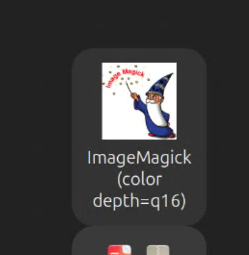

# XCrySDen Installation and Compatibility Guide (Ubuntu 24.04-25.10)

XCrySDen is a crystal and molecular structure visualization tool based on Tcl/Tk.  
This guide is for version `1.6.2` (latest stable).

---

## 1️⃣ Download the Precompiled Package

```bash
xcrysden-1.6.2-linux_x86_64-shared.tar.gz
```

---

## 2️⃣ Extract and Move

```bash
cd ~/Downloads
tar -xvf xcrysden-1.6.2-linux_x86_64-shared.tar.gz
sudo mv xcrysden-1.6.2-bin-shared /opt/xcrysden
```

---

## 3️⃣ Install Dependencies

```bash
sudo apt update
sudo apt install tk libglu1-mesa libtogl2 libxmu6 imagemagick openbabel libgfortran5 libfftw3-dev
```

---

## 4️⃣ Fix Compatibility (Togl & Wayland)

Find and link Togl library:

```bash
dpkg -L libtogl2 | grep -i '\.so'
sudo ln -s /usr/lib/x86_64-linux-gnu/Togl2.0/libTogl2.0.so /usr/lib/x86_64-linux-gnu/libTogl.so.2
```

Configure the following environment variables:

```bash
vi ~/.bashrc
```

Add this command at the end of file.

```ini
alias xcrysden='env GDK_BACKEND=x11 /opt/xcrysden/xcrysden'
```

Save it and do:

```s
source ~/.bashrc
```

---

## 5️⃣ Disable Incompatible Togl Options

```bash
mkdir -p ~/.xcrysden
cp /opt/xcrysden/Tcl/custom-definitions ~/.xcrysden/
vi ~/.xcrysden/custom-definitions
```

Add the following lines:

```vi
# Safe Togl options for modern systems (Wayland/XWayland)
set toglOpt(rgba)   true
set toglOpt(double) true
set toglOpt(depth)  true

set toglOpt(accum)   false
set toglOpt(stencil) false
set toglOpt(stereo)  false
set toglOpt(overlay) false
```

## 6️⃣ Create a Desktop Shortcut

```bash
sudo vi /usr/share/applications/xcrysden.desktop
```

```ini
[Desktop Entry]
Name=XCrySDen
Comment=Crystalline and Molecular Structure Visualization
Exec=env GDK_BACKEND=x11 /opt/xcrysden/xcrysden
Icon=/opt/xcrysden/images/xcrysden.png
Terminal=false
Type=Application
Categories=Science;Education;Chemistry;Physics;
```

```bash
sudo chmod +x /usr/share/applications/xcrysden.desktop
sudo update-desktop-database
```

---

## 7️⃣ Verify Installation

```bash
xcrysden
```

## Extra Step

The imagemask icon name will be shown after installation, but the name is wrong.



```bash
sudo vi /usr/share/applications/display-im6.q16.desktop
```

```vi
Name = ImageMagick Viewer
```

```bash
sudo update-desktop-database
```
